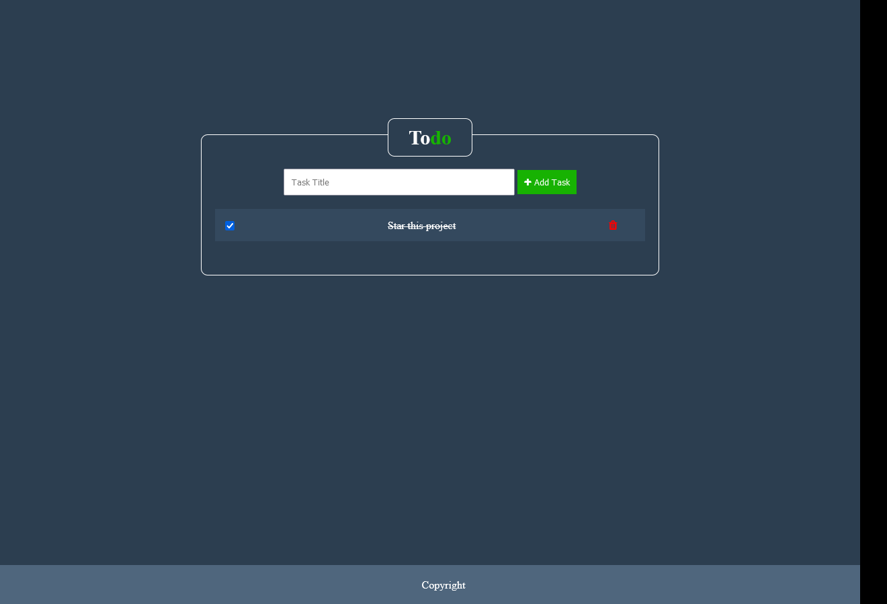

# Todo list

Todo app with Laravel 8 & Vuejs

### Features

-   Add task
-   Mark task as completed
-   Delete task



### Installation

1. Rename `.env.example` to `.env`
2. Run command `composer install`
3. Run command `npm install`
4. Add database credentials to `.env`
5. Run command `php artisan migrate`
6. Run command `php artisan key:generate`
7. Run command `php artisan serve`
8. Open `localhost:8000` in the browser

### Run jager

```
docker run -d --name jaeger \
  -e COLLECTOR_ZIPKIN_HOST_PORT=:9411 \
  -e COLLECTOR_OTLP_ENABLED=true \
  -p 6831:6831/udp \
  -p 6832:6832/udp \
  -p 5778:5778 \
  -p 16686:16686 \
  -p 4317:4317 \
  -p 4318:4318 \
  -p 14250:14250 \
  -p 14268:14268 \
  -p 14269:14269 \
  -p 9411:9411 \
  jaegertracing/all-in-one:latest
```
